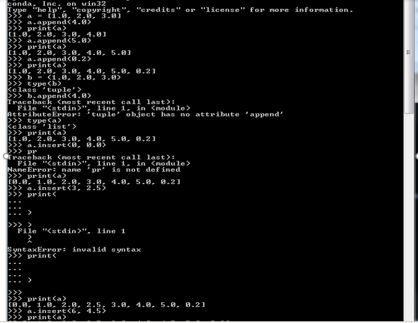

# Metodos Numericos
## Objetivo de la materia
La asignatura de métodos numéricos aporta al perfil del ingeniero mecatrónico la capacidad de aplicar herramientas matemáticas, computacionales y métodos experimentales en la solución de problemas para formular modelos, analizar procesos y elaborar prototipos. La asignatura requiere que el alumno haya cursado cálculo diferencial y cálculo integral, así como Programación Básica.
## Introducción a Python
Python es un lenguaje de Programación orientados a  objetos que fue desarrollado a finales de los 80’s como un  lenguaje de tipo script. Python tiene el objetivo de ser un lenguaje para el desarrollo rápido de aplicaciones en ingeniería. Los programas de Python no son compilados, si no que trabajan bajo un intérprete.
Python tiene algunas ventajas sobre otros lenguajes de programación como:
	Python es un software de código abierto, lo que quiere decir que es libre y gratuito y es concluida en todas las computadoras con distribuciones Linux o Mac.
	Python puede correr sus scripts en todas las plataformas (Windows, Linux, Macos) sin tener que modificar ninguna parte del programa.
	 Python es fácil de aprender y produce un código más amigable que otros lenguajes.
	Python y sus extensiones son fáciles de instalar.
## Introducción
En este capítulo, dos estrellas de solución de citas algebraicas lineales de conocimientos desconocidos. Es, con mucho, el tema más largo y posiblemente el más importante del libro. Hay una buena razón para su importancia: es casi imposible llevar a cabo análisis numéricos de cualquier tipo sin encontrar ecuaciones simultáneas. Además, los conjuntos de ecuaciones que surgen de problemas físicos a menudo son muy grandes y consumen muchos recursos computacionales. Por lo general, es posible reducir los requisitos de almacenamiento y el tiempo de ejecución mediante la explotación de propiedades especiales de la matriz eficiente, como la dispersión (la mayoría de los elementos de una matriz dispersa son cero). Por lo tanto, existen muchos algoritmos dedicados a la solución de conjuntos de ecuaciones grandes, cada uno de ellos adaptado a una forma particular de la matriz de coeficientes (simétrica, en bandas, dispersa, etc.). Una colección bien conocida de estas rutinas es LAPACK: Linear Algebra PACKage, originalmente escrita en Fortran77.1. No podemos discutir todos los algoritmos especiales en el espacio limitado disponible. Lo mejor que podemos hacer es presentar los métodos básicos de solución, complementados por algunos algoritmos de algoritmos de seguridad para las matrices de coeficientes.


## VARIABLES
En la mayoría de lenguajes el nombre de una variable representa un valor de un determinado tipo guardado en una ubicación de memoria. El valor puede cambiar, pero no el tipo. Esto no pasa en Python ya que sus variables son tapadas dinámicamente. Una sesión del intérprete de Python cuyo pront son 3 símbolos de mayor que (>>>) ilustra esta característica. Un comentario en Python debe comenzar con el signo “#”.

## CADENAS
Una cadena es una secuencia de caracteres encerrada entre apostrofes, las cadenas son concatenadas con el operador “+” mientras que el operador es usado para extraer una porción de la cadena.
Una cadena puede ser dividida en sus componentes utilizando el comando “Split” los componentes deben de aparecer como elementos en una lista.
TUPLA
Una tupla es una secuencia de objetos arbitrarios separados por comas “ , ” y encerrados entre paréntesis “ (,) ”. Si la tupla contiene un solo objeto, una coma al final del objeto será necesaria; por ejemplo x= (2,).
Las tuplas soportan el mismo tipo de operaciones que las cadenas, por ejemplo: 
```
>>> rec = ('Smith', 'John', (6,23,68)) # Esta es una tupla 
>>> apellido, nombre, fecha de nacimiento = rec # Desempacando la tupla 
>>> print (nombre) 
John
>>> año de nacimiento = fecha de nacimiento [2] 
>>> print (año de nacimiento) 
68 
>>> nombre = rec [1] + '' + rec [0] 
>>> print (nombre)
 John Smith
 >>> print (rec [0] : 2])

 ('Smith', 'John')

```
## Listas
Una lista es similar a una tupla, sin embargo, sus elementos y su longitud pueden cambiar. Una lista es identificada por que sus datos están encerrados en corchetes.
```
a • append (4.0)
```
Se puede determinar la longitud de una lista con el comando “Len”, por ejemplo:
(listan ant)
Print (len(a))
También se puede modificar elementos internos en una lista, por ejemplo:
```
Prin (a) … (0.0, 0.5) …
Las matrices son representadas por listas anidadas, con cada fila siendo un elemento de la lista, por ejemplo, insertar matriz “(a)”.
A= (1&2&3@4&5&6@7&8&9)
````
Módulos matemáticos 
	Math
	Numpy
El módulo math
La mayoría de funciones matemáticas están incluidas en el núcleo de python, pero también pueden importarse. Hay 3 formas de acceder a las funciones en un módulo.
La primera forma es importando todo el módulo utilizando la instrucción:
from math import*
(Va llamar los módulos de math)
El uso de este método no es recomendable porque carga módulos y comandos que tal vez no usemos.
Una mejor manera de importar es utilizando el comando:
from math import func1, func2, …
from math import.
Hay una 3r forma de importar los módulos la cual es:
“import math”.
Un módulo puede ser accesible bajo un alias, por ejemplo, el módulo math puede ser llamado mediante el alias “m”, de la siguiente forma.
import math as chicharo
chicharo. cos (0.15)
Los contenidos de un módulo pueden ser llamados e impresos con la función 
“dir (math)”        importa en lista comandos de math.

“Módulo numpy”
El módulo numpy no está incluido en el módulo de python y debe descargarse e instalarse, además implementa funciones del algebra lineal y funciones de manejo de vectores.
Los arreglos pueden ser creados de diferentes formas. Uno de ellos es el uso de las funciones ARRAY para convertir una lista en un arreglo mediante el comando:
Array(lista,tipo)
La función arange devuelve una secuencia de números entre 2 límites y con un elemento configurado.
Otra función disponible es la creación de matrices con componente CERO utilizando la función:
#zeros((dim1,dim2,) tipo)
El comando ONES crea un arreglo con definiciones del usuario :
#ones((dim1,dim2,)tipo)

Condicionales
La construcción if si condición: bloquear ejecuta un bloque de declaraciones (que deben tener sangría) si la condición devuelve Cierto. Si la condición devuelve False, se omite el bloque. El if condicional puede ser seguido por cualquier número de construcciones elif (abreviatura de "else if") condición elif: bloquear que funcionan de la misma manera. La cláusula else más: bloquear se puede usar para definir el bloque de sentencias que se ejecutarán si ninguna de las cláusulas if-elif son verdaderas. El signo de función de a ilustra el uso de los condicionales.
def sign_of_a(a):
     if a < 0.0: 
         sign = ’negative’ 
     elif a > 0.0:
         sign = ’positive’ 
     else: 
           sign = ’zero’ 
       return sign 
a = 1.5
 print(’a is ’ + sign_of_a(a))

SISTEMA DE ECUACIONES ALGEBRAICAS 	LINEALES
Objetivo: Resolver ecuaciones simultaneas Ax=b
En este tema procedemos a la solución de N ecuaciones algebraicas lineales con N variables desconocidas. Es un tema muy importante ya que casi es imposible realizar análisis numéricos sin encontrar ecuaciones simultáneas. Además, los conjuntos de ecuaciones de problemas de ingeniería son de forma típica muy grandes y consumen demasiados recursos computacionales. Hay muchos algoritmos dedicados a la solución de grandes conjuntos de ecuaciones, cada uno diseña una forma particular una matriz de coeficientes.
El método que vamos a analizar es el de eliminación de gauss.
NOTACIÓN
Un sistema de ecuaciones algebraicas tiene la forma:
A11 X1 + A12 x2 + … + A 1 nxn = b1
ejercicio 1
#Equipo Jese Manuel Acosta Avila y Gabriela Ramirez Cortez
#13/09/2019
#Ejercicio 1

from numpy import*

print(arange(1,101,2))
file:///C:/Users/jacos/Downloads/hibbeler/capturas%20de%20pantalla%20para%20metodos%20numericos/Captura%20ejercicio1.PNG

##Equipo Jese Manuel Acosta Avila y Gabriela Ramirez Cortez
#13/09/2019
#Ejercicio 2

from numpy import array

a=array([[1.44, -0.36, 5.52, 0.00], [-0.36, 10.33, -7.78, 0.00], [5.52, -7.78, 28.40, 9.00], [0.00, 0.00, 9.00, 61.00]])
print(a)

b=array([[0.04], [-2.15], [0], [0.88]])
print(b)

#Equipo Jese Manuel Acosta Avila y Gabriela Ramirez Cortez
#20/09/2019
#Ejercicio 3: Determinar que la matriz A es singular

import numpy as np
A = np.array([[2.1,-0.6,1.1],[3.2,4.7,-0.8],[3.1,-6.5,4.1]])
detA = np.linalg.det(A)
print('La determinante de A es: %.2f'%detA )


#Equipo Jese Manuel Acosta Avila y Gabriela Ramirez Cortez
#20/09/2019
#Ejercicio 4: Realizar un programa en el que el usuario introduzca los 9 elementos de una matriz 3*3 y que el programa le debuelva al usuario si la matriz que inserto es singular o no.

import numpy as np
print('Introduce los 9 datos de tu matriz: ')
a11 = float(input('a11= '))
a12 = float(input('a12= '))
a13 = float(input('a13= '))
a21 = float(input('a21= '))
a22 = float(input('a22= '))
a23 = float(input('a23= '))
a31 = float(input('a31= '))
a32 = float(input('a32= '))
a33 = float(input('a33= '))

A = np.array([[a11,a12,a13],[a21,a22,a23],[a31,a32,a33]])
detA = np.linalg.det(A)
if np.round(detA,0) == 0.0:
    print('La matriz A es singular')
else: 
    print('la matriz A no es singular, es: %.2f' %detA )

#Equipo Jese Manuel Acosta Avila y Gabriela Ramirez Cortez
#26/09/2019
#Ejercicio 5

import numpy as np
L = np.array([[1,0,0],[2,3,0],[4,5,6]])
c = np.array([[1],[2],[3]])
def calcula_x(c,L):
    x1 = c[0]/L[0,0]
    x2 = (c[1]-(L[1,0]*x1))/L[1,1]
    x3 = c[2]-(L[2,0]*x1)-(L[2,1]*(x2))/L[2,2]
    return x1,x2,x3

print (x1)
print (x2)
print (x3)
Fase de eliminacion  
Veamos en las ecuaciones en algún instante de la fase de eliminación. Asumamos que las primeras “k - filas” de “A” han sido transformadas a una forma de matriz triangular.


#Equipo Jese Manuel Acosta Avila y Gabriela Ramirez Cortez
import numpy as np ejercicio6
def elimGauss(A,b):
    n = len(b)
    #face de eliminacion
    for k in range(0,n-1):
        for i in range(k+1,n):
            if a[i,k] != 0.0:
                lam = a[i,k]/a[k,k]
                a[i,k+1:n] = a[i,k+1:n] - lam*a[k,k+1:n]
                b[i] = b[i]-lam*b[k]
    return a,b 
a = np.array([[4.0,-2.0,1.0],[-2.0,4.0,-2.0],[1.0,-2.0,1.0]])
b = np.array([[11.0],[-16.0],[17.0]])
a,b = elimGauss(a,b)
print(a)
print(b)
https://github.com/jese19998/metodos-numericos-nuevo-archivo/blob/master/ejercicio6.PNG

1. Usar el método de eliminación de Gauss para encontrar la solución del sistema de ecuaciones

#Equipo Jese Manuel Acosta Avila y Gabriela Ramirez Cortez
#11/10/2019
#Ejercicio 14

#fase de eliminacion
import numpy as np
def elimGauss(a,b):
    n=len(b)
    for k in range(0,n-1):
        for i in range(k+1,n): 
            if a[i,k] != 0.0: 
                lam=a[i,k]/a[k,k]
                a[i,k+1:n]=a[i,k+1:n]-lam*a[k,k+1:n]
                b[i]=b[i]-lam*b[k]

# fase de eliminacion hacia atras
    for k in range(n-1,-1,-1):
        b[k] = (b[k] - np.dot(a[k,k+1:n],b[k+1:n])) /a[k,k]
        return b               
        
A=np.array([[-2.0,0.0,1.0],[-1.0,7.0,1.0],[5.0,-1.0,1.0]])
b=np.array([-4.0,-50.0,-26.0])

b=elimGauss(A,b)
print(A)
print(b)                


#Equipo Jese Manuel Acosta Avila y Gabriela Ramirez Cortez
#25/10/2019
#Ejercicio 16

import numpy as np
import matplotlib.pyplot as plt

#Vamos a crear dos listas vacias

X = []
Y = []

#Vamos a leer los datos del archivo .csv (poner los archivos en la carpeta de trabajo)

for linea in open('data_1d.csv'):
    x,y =linea.split(',')
    X.append(float(x))
    Y.append(float(y))

#Convertit la lista a vectores
x = np.array(X)
y = np.array(Y)

#graficar los puntos
plt.scatter(X,Y)
plt.show()

#Equipo Jese Manuel Acosta Avila y Gabriela Ramirez Cortez
#07/11/2019
#Ejecicio 17

import numpy as np
import matplotlib.pyplot as plt

#creando lista vacia
X=[]
Y=[]

for linea in open('data_1d.csv'):
    x, y=linea.split(',')
    X.append(float(x))
    Y.append(float(y))
    
X=np.array(X)
Y=np.array(Y)

#Ecuaciones para obtener a y b
den=X.dot(X)-X.mean()*X.sum()
a=(X.dot(Y)-Y.mean()*X.sum())/den
b=(Y.mean()*X.dot(X)-X.mean()*X.dot(Y))/den

#Equipo Jese Manuel Acosta Avila y Gabriela Ramirez Cortez
from mpl_toolkits.mplot3d import Axes3D
import numpy as np
import matplotlib.pyplot as plt

#Lista vacia
X=[]
Y=[]

#Leeyendo el archivo .csv
data=open('data_2d.csv')
for linea in data:
    x1,x2,y=linea.split(',')
    X.append([float(x1),float(x2)])
    Y.append([float(y)])

X=np.matrix(X)
Y=np.array(Y)

#Graficar los puntos
fig=plt.figure()
ax=fig.add_subplot(111,projection='3d')
ax.scatter(X[:,1],X[:,2],Y)
ax.set_xlabel('x1')
ax.set_ylabel('x2')
ax.set_zlabel('y')
plt.show()

#Equipo Jese Manuel Acosta Avila y Gabriela Ramirez Cortez
#21/11/2019
#Ejercicio 22 Integral definida

from sympy import *
init_printing(use_unicode=False, wrap_line=False)
x=Symbol('x')
a=integrate(x**3-6*x**2+11*x-6,(x,1.3,1.8))
print(a)

#Equipo Jese Manuel Acosta Avila y Gabriela Ramirez Cortez 
#21/11/2019
#Ejercicio 22 Integral indefinida

from sympy import *
init_printing(use_unicode=False, wrap_line=False)
x=Symbol('x')
a=integrate(x**3-6*x**2+11*x-6,x)

print(a)

#Equipo Jese Manuel Acosta Avila y Gabriela Ramirez Cortez
#21/11/2019
#Ejercicio 24 

import matplotlib.pyplot as plt
def funcion(x):
    return x**3-6*x**2+11*x-6


a=1.3
b=1.8
fa = funcion(a)
fb = funcion(b)

A=((b-a)*((fa+fb)/2.))
print(A)

plt.scatter(a,b)
plt.plot(x)
plt.show()

https://github.com/jese19998/metodos-numericos-nuevo-archivo/blob/master/matloplotlib.PNG

#Equipo Jese Manuel Acosta Avila y Gabriela Ramirez Cortez
#22/11/2019
#Ejercicio 25 con las graficas

import matplotlib.pyplot as plt
from sympy import *
init_printing(use_unicode=False, wrap_line=False)
x=Symbol('x')

a=x**6,x
b=x**1/2*1,x
c=2*x**3-5*x**2-3*x+4,x

d=integrate(x**6,x)
e=integrate(x**1/2*1,x)
f=integrate(2*x**3-5*x**2-3*x+4,x)

print(d)
sp.plot(x**1/2*1,integrate(x**1/2*1,x))

print(e)
sp.plot(x**6,integrate(x**6,x))

print(f)
sp.plot(2*x**3-5*x**2-3*x+4,integrate(2*x**3-5*x**2-3*x+4,x))

#Equipo Jese Manuel Acosta Avila y Gabriela Ramirez Cortez
from mpl_toolkits.mplot3d import Axes3D
from sympy import * 
import numpy as np
import matplotlib.pyplot as plt

def f(x):
    return np.exp(x) * np.sin(x)

x = np.linspace(0, np.pi, 101)
plt.plot(x, f(x))
plt.grid()
plt.show()

def simpson13(n, a, b, f):

    h = (b - a) / n
   
    suma = 0.0


    for i in range(1, n):
        #calculamos la x
        #x = a - h + (2 * h * i)
        x = a + i * h
        # si es par se multiplica por 4
        if(i % 2 == 0):
            suma = suma + 2 * fx(x, f)
        #en caso contrario se multiplica por 2
        else:
            suma = suma + 4 * fx(x, f)
    #sumamos los el primer elemento y el ultimo
    suma = suma + fx(a, f) + fx(b, f)
    #Multiplicamos por h/3
    rest = suma * (h / 3)
    #Retornamos el resultado
    return (rest)

#Funcion que nos ayuda a evaluar las funciones
def fx(x, f):
    return eval(f)

#valores de ejemplo para la funcion sin(x) con intervalos de
n = 200
a = 0.1
b = 2.0
f = '2*x**3-5*x**2+3*x+5'


print(simpson13(n, a, b, f))
https://github.com/jese19998/metodos-numericos-nuevo-archivo/blob/master/grafica%20curva.PNG

#Equipo Jese Manuel Acosta Avila y Gabriela Ramirez Cortez 
#22/11/2019
#Ejercicio 25 Resultados de las integrales

import matplotlib.pyplot as plt
from sympy import *
init_printing(use_unicode=False, wrap_line=False)
x=Symbol('x')

a=integrate(x**6,x)
b=integrate(x**1/2*1,x)
c=integrate(2*x**3-5*x**2-3*x+4,x)

print(a)
print(b)
print(c)

def funcion(x):
    return (3-4*x)/((3*x-x**2-2)**1/2)


a=-1
b=3
fa=funcion(a)
fb=funcion(b)

D=((b-a)*((fa+fb)/2.))
print(D)

plt.scatter(a,b)
plt.plot(x)
plt.show()

#Equipo Jese Manuel Acosta Avila y Gabriela Ramirez Cortez
#Ejercico 27
#29-noviembre-2019

from sympy import * 
import numpy as np
import matplotlib.pyplot as plt

def funcion(x):
    return 2*x**3-5*x**2+3*x+5

n=float(input('Ingersa tu valor menor: '))
a=0
b=n

fa=funcion(a)
fb=funcion(b) 

A=(b-a)*((fa+fb)/2.0)

f = lambda x : 2**3+x**2+5
a = 0; b =100 ; N = 10
n = 5

x = np.linspace(a,b,N+1)
y = f(x)

X = np.linspace(a,b,n*N+1)
Y = f(X)

plt.plot(X,Y)

for i in range(N):
    xs = [x[i],x[i],x[i+1],x[i+1]]
    ys = [0,f(x[i]),f(x[i+1]),0]
    plt.fill(xs,ys,'c',edgecolor='b',alpha=0.2)

plt.title("trapezoide")
plt.show()

print(A)
https://github.com/jese19998/metodos-numericos-nuevo-archivo/blob/master/trapezoide.PNG

#Equipo Jese Manuel Acosta Avila y Gabriela Ramirez Cortez
from tkinter import *

class Mi_primera_GUI:
    def __init__(self, master):
        self.master = master
        master.title("Una GUI sencilla")

        self.etiqueta = Label(master, text="Mi primera GUI")
        self.etiqueta.grid(eow=0, column=0)

        self.boton_saludo = Botton(master, text="Saludos", command=self.saludar)
        self.boton_saludar.grid(row=1, column=0)

        self.boton_cerrar = Botton(master, text="Cerrar", command=master.squit)
        self.boton_cerrar.grid(eow=1, column=1)
    
    def saludar(self):
        print('Saludos')

    def darBuenos(self):
        print('Buenos dias') 
	
	#Equipo Jese Manuel Acosta Avila y Gabriela Ramirez Cortez
from tkinter import *

class Mi_primera_GUI:
    def __init__(self, master):
        self.master = master
        master.title("Una GUI sencilla")

        self.etiqueta = Label(master, text="Mi primera GUI")
        self.etiqueta.grid(eow=0, column=0)

        self.boton_saludo = Botton(master, text="Saludos", command=self.saludar)
        self.boton_saludar.grid(row=1, column=0)

        self.boton_cerrar = Botton(master, text="Cerrar", command=master.squit)
        self.boton_cerrar.grid(eow=1, column=1)
    
    def saludar(self):
        print('Saludos')

    def darBuenos(self):
        print('Buenos dias') 
	Eliminación de Gauss con pivote de fila escalado
Considere la solución de Ax = b mediante la eliminación de Gauss con pivote de fila. Recuerde que los objetivos pivotantes mejoran el dominio diagonal de la matriz de coeficientes (es decir, hacer que el elemento pivote sea lo más grande posible en comparación con otros elementos en la fila pivote). La comparación se hace más fácil si esta matriz se presenta con los elementos
Si=max⁡|Aij|,i=1,2,…,n

Así si, llamado el factor de escala de rowi, contiene el valor absoluto del elemento más grande en la línea de A. Los vectores se pueden obtener con el algoritmo 
Para i en el rango (n):
S[i]=max⁡(abs(a[i,:]))
 El tamaño relativo de un elemento Aij (es decir, en relación con el elemento más grande en el i throw) se define como la relación 
Ry=(|Ay|)/Si
Supongamos que la fase de eliminación ha llegado a la etapa en la que el throwrow se ha convertido en la trivotrow.}





